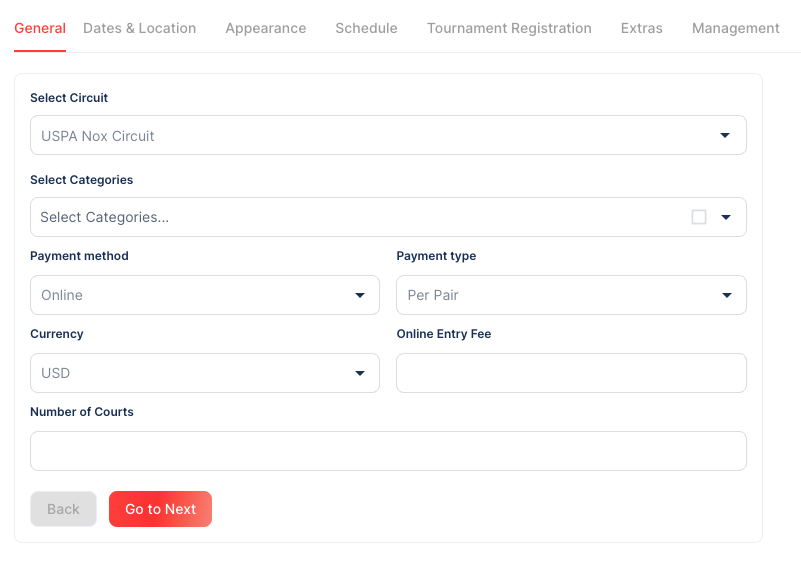
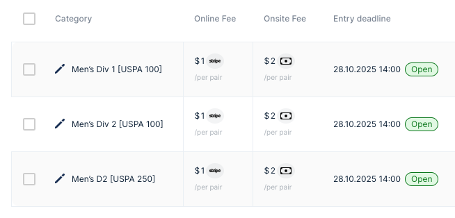

# Tournament Setup

## Create Your Tournament (TMS → "+ Create → Tournament")

You can log in via [manager.tournated.com](https://manager.tournated.com). If your email is the same as your WPR player profile email, you can also log in via [uspa-tournaments.worldpadelrating.com](https://uspa-tournaments.worldpadelrating.com) (player portal) and then click **"Manager"** (top‑right menu).

---

## Calendar & Lead Time

- Confirm your tournament is listed on the **USPA Calendar**.
- **Lead time:** TDs should log in and learn the TMS **at least 8 weeks** before the tournament.

**Cancellation policy (summary):** Tournaments may be automatically **canceled 3 weeks** before the scheduled date if the host club has not submitted their entry fee and created/submitted their tournament. Multiple reminder emails are sent starting 90 days out. Stay responsive and submit required materials on time to avoid removal from the calendar.

---

## 1. General

- **Categories:** Select **one by one**.
- **Payment method:** **Online**
- **Payment type:** **Per pair**
- **Number of courts:** Enter the number available for the tournament.

---

## 2. Dates & Location

- **Entry Deadline & Withdrawal Deadline:** Use the **same date/time** (mind **time zones**).

  - **USPA 100 & Age Group Local:** **Monday 8:00pm ET** (week of the tournament).
  - **All other USPA tournaments:** **Thursday 12:00pm (noon) local time** (week **before** the tournament).

- **Venue:** Select your club(s).

---

## 3. Appearance

- **Logo:** Use your club logo (recommended).

- **Description:** Paste this **mandatory text**:

  - Players should enter the division they would prefer to play in.
  - If oversubscribed, USPA rankings + WPR ratings determine placement (see [USPA Rule Book](https://padelusa.org/competition/rules-and-regulations/)).
  - USPA may move any team entered in a division clearly below its ability.
  - Individual scheduling requests cannot be accommodated.
  - Tournament-specific questions: contact the Tournament Director (TD), not USPA/WPR.
  - Withdrawal before the deadline: Visit tournament listing --> My Details --> ticket icon --> Withdraw.
  - Partner changes before the deadline: email the TD.
  - After the deadline: email the TD for withdrawals/partner changes.
    - In D1 of USPA 2500/2000/1500/1000/500, no partner changes after the draw is published.
  - No refunds for withdrawals after the deadline.

- **Tournament Poster:** Upload a **800 × 800** poster (follow USPA guidelines).

- **Cover Banner:** Do not upload.

---

## 4. Schedule (Optional)

Use for **high‑level events** (e.g., player party, practice court blocks) to appear on the public page. **Do not** enter specific match times here (those are set later).

---

## 5. Tournament Registration

All items optional. Important: Mind your selections for the two Fee Coverage choices at the bottom.

- **Additional Questions:** Add custom fields (e.g., T‑shirt size, image upload). Can be per category and mandatory/optional.
- **Terms & Conditions:** Paste club/venue waiver or similar text for acceptance at entry.
- **External Registration Link:** Redirects the "Register" button elsewhere. **DO NOT USE** (players should register in TMS).
- **Welcome/Success Messages:** Optional Pre and post‑registration messages to players.
- **Email Notifications:** Enable/disable notifications to TD and players for new/approved entries.
- **Automatic Confirmation:** Enable if you don't want a manual approval step.
- **Fee Coverage:** Choose whether the club or the player covers platform/Stripe fees.

---

## 6. Extras

- **Skip** (not required).

---

## 7. Management

- **Organizer:** Select **you/your organization**. (The staff member selected as Organizer during setup for a given tournament will have their contact info listed on that tournament's public page.)
- **Referees:** Skip (unless applicable).
- **Tournament status:** **Active**.

---

## 8. Fact Sheet (Optional)

- You can upload a **Fact Sheet** later via the **Documents** tab (appears in the sidebar after submission).

---

## 9. Discounts (Optional)

- Configure if desired.
- **USPA policy note:** In sanctioned tournaments, players may only enter multiple divisions if one is **Mixed or Coed** (e.g., **Men's D1 + Mixed D1**). Entries like **Men's D1 + Men's D2** (even with different partners) are **not permitted**.

## 10. Submit & Approval

**Submit:** When finished with all settings, click **Submit**. USPA will review/approve the tournament for public listing.

General Settings are now complete.

---

## 11. Categories (Optional)

Configure per category (open the **pencil icon / CHANGE SETTINGS**):

- **General:** Category color.
- **Participants & Seedings:** Set **maximum teams** if needed. (**Do not** enter # of seeds here; # of seeds is determined later based on entries)
- **Payments:** Add **VAT/tax** if applicable.
- **Group Stage Points Allocation:** Default is set per USPA rules for round robin standings. (Leave as is unless instructed).

---

## 12. Courts (Optional)

- **Skip** (Courts are configured later, during scheduling).

---

### Approval & Public Listing

After submission, the USPA reviews and approves. Once approved, your event is publicly listed and open for entries at [uspa-tournaments.worldpadelrating.com](https://uspa-tournaments.worldpadelrating.com). Complete this **≥ 8 weeks** before the event.
